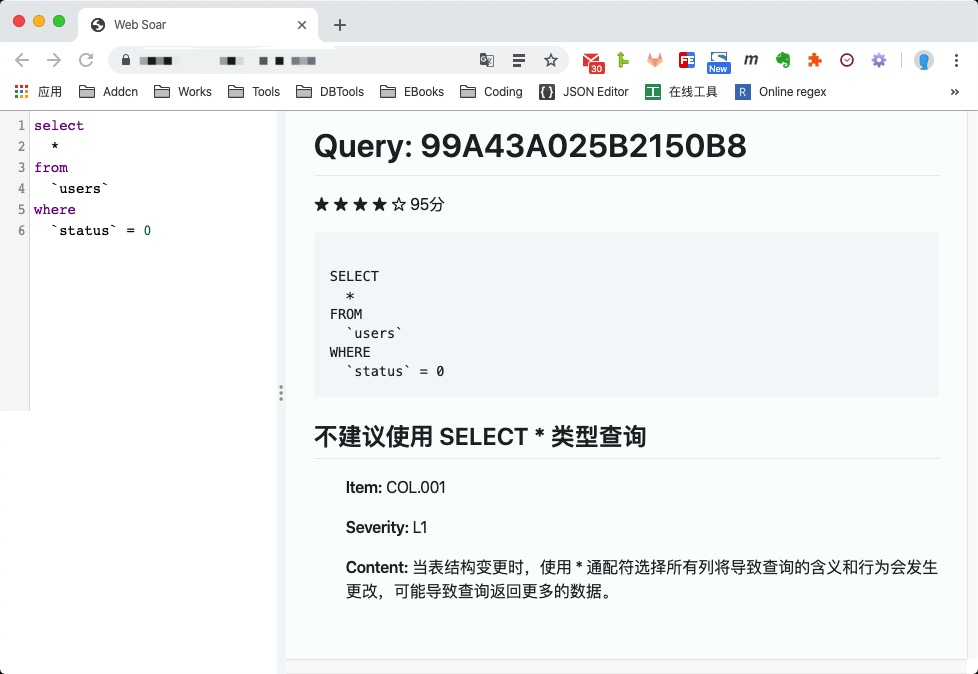

# laravel-web-soar

## Installation

~~~bash
composer require huangdijia/laravel-web-soar --dev
~~~

### Publish

~~~bash
php artisan vendor:publish --provider="Huangdijia\WebSoar\WebSoarServiceProvider"
php artisan web-soar:install
~~~

### Download soar

~~~bash
# macOS
* wget https://github.com/XiaoMi/soar/releases/download/0.11.0/soar.darwin-amd64 -O vendor/bin/soar
# linux
* wget https://github.com/XiaoMi/soar/releases/download/0.11.0/soar.linux-amd64 -O vendor/bin/soar
# windows
* wget https://github.com/XiaoMi/soar/releases/download/0.11.0/soar.windows-amd64 -O vendor/bin/soar
# authorization
* chmod +x vendor/bin/soar
~~~

## Configure

### Env

~~~env
SOAR_ENABLED=true
SOAR_HINT_ENABLED=true
SOAR_HINT_CONNECTION=mysql
SOAR_PATH=/usr/local/bin/soar # linux
SOAR_TEST_DSN_HOST=127.0.0.1
SOAR_TEST_DSN_PORT=3306
SOAR_TEST_DSN_DBNAME=yourdb
SOAR_TEST_DSN_USER=root
SOAR_TEST_DSN_PASSWORD=
SOAR_LOG_OUTPUT=/tmp/soar.log
SOAR_REPORT_TYPE=markdown
~~~

### Gate

~~~php
// AuthServiceProvider
Gate::define('viewWebSoar', function($user = null) {
    return app()->environment('local', 'dev');
});
~~~

## Run

* [http://youdomain.com/soar](http://youdomain.com/soar)

## Thanks

* [soar](https://github.com/XiaoMi/soar)
* [soar-php](https://github.com/guanguans/soar-php)
* [laravel-web-tinker](https://github.com/spatie/laravel-web-tinker)
